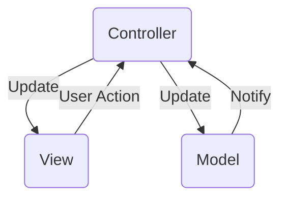

# 4주차

## mutating 키워드에 대해 설명하시오.

### 정의

- mutating : 변화시키다, 돌연변이
- 해당 메서드가 호출된다면 실제 복사를 해야한다고 알려줌
- 값 타입의 속성은 기본적으로 인스턴스 메서드 내에서 수정 X
    - 만약 수정해야 하는 경우 matating을 붙여주면 됨
- mutating을 선언한 메서드
    - 메서드 내에서 프로퍼티 변경 가능
    - 메서드가 종료될 때 변경한 모든 내용을 원래 struct에 다시 기록
    - 메서드는 self 프로퍼티에 새 인스턴스 할당 가능

### 사용 방법

- 내부에서 값 변경
    - 인스턴스 메서드에서 구조체 내부의 값 변경
    
    ```swift
    struct Point {
        var x = 0.0, y = 0.0
        mutating func moveBy(x deltaX: Double, y deltaY: Double) {
            x += deltaX
            y += deltaY
        }
    }
    
    var somePoint = Point(x: 1.0, y: 1.0)
    somePoint.moveBy(x: 2.0, y: 3.0)
    ```
    
- 새로운 인스턴스 할당
    - 인스턴스 메서드에서 self를 통해 새로운 인스턴스 할당
    
    ```swift
    struct Point {
        var x = 0.0, y = 0.0
        mutating func moveBy(x deltaX: Double, y deltaY: Double) {
            self = Point(x: x + deltaX, y: y + deltaY)
        }
    }
    
    var somePoint = Point(x: 1.0, y: 1.0)
    somePoint.moveBy(x: 2.0, y: 3.0) // → somePoint 의 값 : (3.0, 4.0)
    ```
    

### 예시

```swift
struct Point {
    var x = 0.0, y = 0.0
    mutating func moveBy(x deltaX: Double, y deltaY: Double) {
        x += deltaX
        y += deltaY
    }
}
var somePoint = Point(x: 1.0, y: 1.0)
somePoint.moveBy(x: 2.0, y: 3.0)
print("The point is now at (\(somePoint.x), \(somePoint.y))")
```

- Point struct에 Point 인스턴스를 이동하는 mutating func moveBy()를 정의했는데 이는 새로운 Point를 반환하는 대신 실제로 호출된 Point 수정
    - 만약 let으로 선언된 인스턴스는 프로퍼티가 변수여도 속성을 변경 X
        
        ⇒ mutating 메서드를 호출 X
        

### 주의

- let으로 선언된 Value Type은 Mutating 메서드를 사용하더라도 값 변경 X

## 탈출 클로저에 대하여 설명하시오.

### **정의**

- 함수의 인자로 전달된 클로저가 함수의 밖의 변수에 저장되거나 함수가 종료된 뒤 실행되는 클로저
- 전달 인자로 받은 클로저가 함수 종료 후에 호출될 경우 “클로저가 함수를 탈출한다”라고 표현

### **사용법**

- 클로저를 매개변수로 갖는 함수를 선언할 때, 매개변수 이름 콜론 뒤에 **@escaping** 키워드를 사용하여 명시

### **예시**

- non-escaping
    - 함수 밖의 변수에 인자로 전달된 클로저 대입을 시도하면 컴파일 타임 에러 발생
    
    ```swift
    class testClass {
    	var property : (() -> Void)?
        
    	func closureFunc(_ closure : () -> Void ) {
    		self.property = closure // Error 
        }
    }
    ```
    
- escaping
    - 함수 밖에서 인자로 전달된 클로저를 사용하고 싶다면 @escaping 키워드 사용
    
    ```swift
    class testClass {
    	var property : (() -> Void)?
        
    	func closureFunc(_ closure : @escaping () -> Void ) {
    		self.property = closure 
        }
    }
    ```
    

### 주의

- 탈출 클로저임을 명시했을 경우
    - 클로저 내부에서 프로퍼티, 메서드, 서브스크립트 등에 점근하기 위해서는 반드시 **self** 키워드를 넣어야함

### 언제 탈출?

- @escaping을 꼭 붙여줘야하는 경우
    - 전달 받은 클로저가 클로저 함수 외부로 다신 반환되는 경우
    - 외부 글로벌 변수에 저장되는 경우

⇒ 변수의 scope 개념을 무시하는 것으로 함수에서 선언된 로컬 변수가 로컬 변수의 영억을 뛰어넘어 함수 밖에서도 유효하기 때문

- scope : 변수, 상후, 함수 등의 이름이 유효한 범위
    
    = 어떤 이름이 코드의 어느 부분에서 참조될 수 있는지 결정
    

### 왜 탈출?

- 보통 비동기 작업을 하기 위해 클로저 탈출시킴
- 클로저를 가장 자주 사용하는 경우 : Completion Handler
    - 예 ) 네트워크 요청 작업이 있고 비동기적으로 이를 처리하고 이 처리가 끝난 후 동작하는 것을 Completion Handler에 명령하는 것-
- 탈출 클로저를 사용해 결과를 받아오고 결과에 맞는 분기처리로 해당 함수 구문 밖에서도 적절한 동작을 할 수 있도록 설계

### 강한 순환 참조

- 클로저의 컨택스트 캡처라는 특성 때문에 클로저에서 클래스 내부의 인스턴스를 참조할 때는 강한 순환 참조를 일으켜 메모리 누수 발생시킬 수 있음
- 순환 참조를 방지하기 위해 weak self 키워드 사용
    - 약한 참조는 실제 객체를 소유하지 않아 레퍼런스 카운트를 증가시키지 X
    - 이때 참조 중인 객체를 강하게 유지하지 않기 때문에 약한 참조가 객체에 대한 참조를 유지중이어도 deallocate 될 수 있기 때문
        
        ⇒ 약한 참조는 optional 타입으로 nil 대입 가능
        
        - non-escaping 클로저에서는 함수의 scope 내에서 모든 작업이 이루어지고 종료되므로 약한 참조 필요 X

## Optional 이란 무엇인지 설명하시오.

### 정의

- 값이 있을 수도, 없을 수도 있는 상황을 나타내는 타입
    
    = 특정 변수나 상수가 nil이 될 수 있음을 표현하기 위해 사용
    
- 두 가지의 상태
    - nil : 값이 없음
    - Some (Wrapped) : 값이 존재하며, Wrapped는 그 값을 나타냄

### 옵셔널 값 추출

- **강제 추출**
    - 옵셔널에 값이 있다고 확실할 때 사용
    - 느낌표를 붙여서 추출
    
    ```swift
    let unwrappedString: String = optionalString!
    ```
    
- **옵셔널 바인딩**
    - 안전하게 옵셔널 값 추출
    - if let 또는 guard let 구문과 함께 사용
    
    ```swift
    if let number = optionalNumber {
        print("optionalNumber has a value of \(number)")
    } else {
        print("optionalNumber is nil")
    }
    ```
    
    - optionalNumber가 nil이 아니라면 그 값을 number에 할당하고 해당 코드 블럭 실행
    - 만약 nil이라면 else 절의 코드 실행
- **묵시적 추출 옵셔널**
    - 일반적인 옵셔널과 거의 동일하지만 매번 값을 추출하지 않아도 됨
        - 매번 값을 접근할 때마다 언래핑 X
    - 선언 시 느낌표 사용
    - 인스턴스 초기화 과정에서 사용
    
    ```swift
    var implicitlyUnwrappedOptional: Int! = 5
    let normalInteger: Int = implicitlyUnwrappedOptional
    ```
    

**주의**

- 강제 추출
    - 값이 있는 경우에만 안전하게 사용 가능
    - nil인 옵셔널을 강제로 추출하면 런타임 오류 발생
- 예상치 못한 nil
    - 예상치 못한 시점에서 값이 nil인 상황을 만나면 예기치 않은 결과 초래
    - 가능한 한 nil 상태를 명확하게 처리하는 것이 중요
- 불필요한 감싸기
    - 모든 변수나 상수를 기본적으로 옵셔널로 선언하는 것은 바람직 X
    - 실제로 값이 없을 수 있는 경우에만 옵셔널 사용
- 묵시적 추출 옵셔널
    - 실제로 nil일 경우 여전히 런타임 오류 발생

### 옵셔널 처리

- **옵셔널 체이닝**
    - 옵셔널에 속한 nil이 아닌 다른 옵셔널 참조
        - 옵셔널 값이 nil인 경우, nil 반환 / 그렇지 않으면 값 반환
        - 여러 단계의 메서드, 프로퍼티 등을 호출할 때, 각 단계에서 nil 확인을 따로 하지 않아도 되므로 코드를 간결하게 작성
- **nil 병합 연산자**
    - ?? 연산자를 사용하여 옵셔널 값과 기본값 사이에서 선택적으로 값 할당
    - 옵셔널 값이 nil인 경우, 기본값 사용 / 그렇지 않으면 옵셔널 값 사용

옵셔널 대신

- 기본값 설정
    - 변수를 선언할 때, 기본값을 설정
    - 변수는 항상 값을 가지므로 nil 상태 걱정 X
- 옵셔널 패턴 매칭
    - if case 또는 switch 문에서 옵셔널 패턴 매칭을 사용하여 옵셔널 값 안전하게 처리
- 선택적 연결
    - 여러 단계의 메서드, 프로퍼티 등을 호출할 때, 각 단계에서 nil 확인을 따로 하지 않아도 되므로 코드 간결하게 작성에 도움을 줌

### 옵셔널 변수를 사용하면 코드가 더 복잡해지나?

- 옵셔널 값을 처리하려면 nil 검사를 해야 하고, 옵셔널 바인딩을 사용하거나 강제 추출해야 함
- 이런 '복잡함'은 사실 안전성에 대한 투자옵셔널 없이 코드를 작성하면 null 값에 대한 처리가 누락되어 버그가 발생할 가능성이 높아짐
- 반면, 옵셔널은 개발자에게 명시적으로 값의 유무를 확인하도록 요구함으로써 이런 문제 예방, 옵셔널 체이닝과 nil 병합 연산자와 같은 기능들로 인해 옵셔널 처리 과정 간결

⇒ 올바르게 사용될 경우, 옵셔널은 코드의 안전성과 신뢰성을 크게 향상

⇒ 잠재적인 오류와 버그를 줄일 수 있는 매우 유용한 도구

## MVC 구조에 대해 블록 그림을 그리고, 각 역할과 흐름을 설명하시오.



### 구성 요소

- **Model**
    - 애플리케이션의 데이터와 비즈니스 로직 담당
- **View**
    - 사용자에게 보여지는 부분으로 UI 담당
    - 사용자가 보고 상호작용하는 모든 요소 포함
- **Controller**
    - Model과 View 사이의 연결 역할
    - 사용자의 입력을 받아 Model에 변경 지시, Model에서 변경된 데이터를 가져와 View 업데이트

### 흐름

1. 사용자가 애플리케이션에서 어떤 동작을 수행하면 Controller가 이 동작 인식
2. Controller는 필요한 경우 Model에게 이 동작에 따른 작업 지시
3. Model은 지시받은 작업을 수행하고 결과를 Controller에게 반환
4. Controller는 받은 결과를 바탕으로 View를 업데이트하여 사용자에게 적절한 응답함

### 특징

- 단일 책임 원칙
    - 각 구성 요소는 자신의 역할에 충실해야 함
    - Model : 비즈니스 로직과 데이터 관리
    - View : 사용자 인터페이스와 사용자 상호작용 처리
    - Controller : Model과 View 사이의 연결 역할 담당
- 느슨한 결합
    - 각 구성 요소는 가능한 한 독립적으로 동작할 수 있어야 함
    - 한 부분에서 발생하는 변경이 다른 부분에 최소한의 영향만 주기 때문
- 재사용성과 확장성
    - 코드 재사용 및 확장성 증가
    - 예 ) Model을 여러 View나 Controller에서 사용 가능
- 유지보수 용이
    - 프로젝트 구조를 체계적으로 만들어줌
    - 코드 유지보수 쉬워짐
- 병렬 개발 가능
    - 서로 다른 역할을 하는 팀원들이 동시에 작업하기 쉬워짐

### 주의

- Massive View Controller
    - Controller가 너무 많은 역할을 수행하게 되어 코드가 복잡해지고 유지보수가 어려워지는 상황
    - 컨트롤러의 역할 최소화, 비즈니스 로직은 가능한 Model에 위치시키는 것이 굿
- Model과 View 사이의 직접적인 연결
    - Model과 View 사이에 직접적인 연결 X, 모든 통신은 Controller를 통해
    - 그렇지 않으면, Model과 View 사이에 강력한 결합성이 생겨나서 코드 유지보수 어려워짐
- 컴포넌트 간 독립성 유지
    - 각 컴포넌트간 독립성 유지 중요
    - 한 컴포넌트에서 다른 컴포넌트의 내부 구현에 의존하게 되면, 코드 재사용성과 확장성, 유연성 등 저하